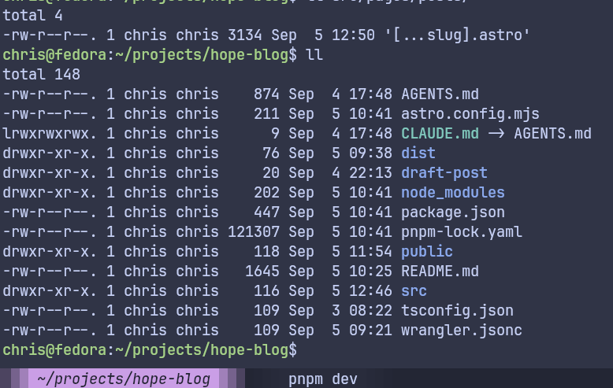
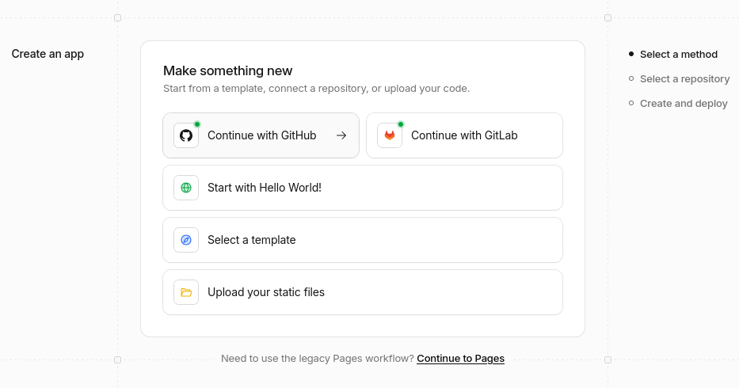
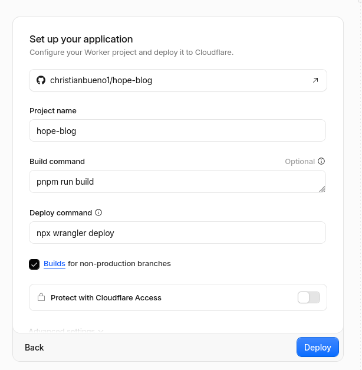

Sí, este mismo blog. Esta es la receta completa que usé para levantarlo en **Fedora 44**: Astro como framework, Tailwind CSS para los estilos, `pnpm` como gestor de paquetes, GitHub con el CLI `gh` para el control de versiones, y Cloudflare Workers en su capa gratuita para servirlo al mundo.

## Requisitos

- Fedora 44 (o cualquier Linux con Node.js instalado)
- Node.js y pnpm instalados
- Una cuenta de GitHub y el CLI `gh` autenticado (`gh auth login`)
- Una cuenta de Cloudflare (gratuita)

## 1. Crear el proyecto con Astro

Con pnpm como gestor de paquetes:

```bash
pnpm create astro@latest hope-blog
cd hope-blog
```


## 2. Agregar Tailwind CSS

Astro tiene una integración oficial que instala y configura Tailwind (v4) en un solo paso:

```bash
pnpm astro add tailwind
```

Esto crea `src/styles/global.css` con el import de Tailwind. Solo falta traerlo al layout:

```js
// src/layouts/Layout.astro
import '../styles/global.css';
```

## 3. Subir el proyecto a GitHub

Con `gh` no necesitas salir de la terminal ni crear el repositorio manualmente en el navegador:

```bash
git init
git add .
git commit -m "Initial commit"
gh repo create hope-blog --public --source=. --remote=origin --push
```

## 4. Preparar Wrangler

Wrangler es la CLI de Cloudflare para construir y desplegar Workers. Como Astro genera un sitio completamente estático (sin partes que corran en el servidor), no hace falta ningún adaptador: basta con apuntar Wrangler a la carpeta `dist/` que genera el build.

```bash
pnpm add -D wrangler@latest
pnpm wrangler --version
touch wrangler.jsonc
```

Contenido de `wrangler.jsonc`:

```json
{
  "name": "hope-blog",
  "compatibility_date": "2026-09-05",
  "assets": {
    "directory": "./dist"
  }
}
```

Si al instalar Wrangler aparece un `pnpm-workspace.yaml` que no pediste, bórralo: puede confundir a pnpm sobre cuál es la raíz del proyecto.

```bash
rm pnpm-workspace.yaml
```

## 5. Probar localmente

Antes de desplegar, construye el sitio y sírvelo con el entorno de Cloudflare simulado localmente:

```bash
pnpm build && pnpm wrangler dev
```

## 6. Desplegar

Con todo probado, el despliegue manual es un solo comando extra:

```bash
pnpm build
pnpm wrangler deploy
```

Wrangler te va a pedir autenticarte con tu cuenta de Cloudflare la primera vez, y al terminar te entrega la URL pública del sitio (`*.workers.dev` por defecto, con opción de agregar tu propio dominio después).

## 7. Automatizar el despliegue




Para no repetir `build` y `deploy` a mano en cada cambio, conecta el repositorio desde el dashboard de Cloudflare:

1. Workers & Pages → Create → Import a repository.
2. Selecciona tu cuenta de GitHub y el repositorio `hope-blog`.
3. Configura el comando de build (`pnpm build`) y el deploy command (`pnpm wrangler deploy`), puedes usar `pnpm wrangler deploy` en vez de `pnx wrangler deploy` si lo instalaste en local como paquete dev `pnpm add -D wrangler@latest`.
4. Save and Deploy.

De ahí en adelante, cada `git push` a la rama principal dispara un build y despliegue automáticos. No necesitas correr `wrangler deploy` de nuevo a mano.

---

Todo lo anterior corre dentro de la capa gratuita de Cloudflare Workers, que es más que suficiente para un blog personal. El resultado: un sitio en Astro, con Tailwind, con historial en GitHub, y con despliegue automático — armado por completo desde una terminal en Fedora.
