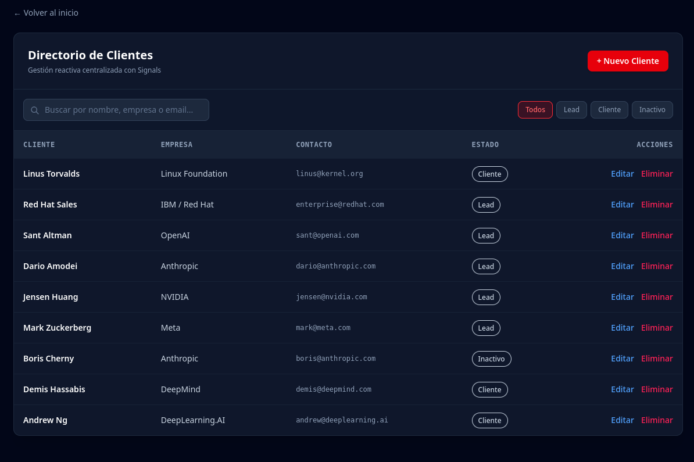

When building dashboards, data tables, or directory views, one requirement always comes up: **filtering datasets in real time**. 

In older Angular versions, you had to manage streams with `RxJS`, `BehaviorSubject`, and manually handle subscriptions or async pipes. In **Angular 22**, you can build a multi-criteria reactive filter system in just a few lines of clean code using **Signals**, `computed()`, and the modern `@Service()` decorator.

This guide covers the core reactive pattern, step-by-step implementation, CLI generation commands, and an adaptability guide for any data structure.

---

## 1. Directory Structure & CLI Setup

Before writing code, let's set up a clean, domain-driven structure. We separate feature views (`pages/`), UI components (`components/`), domain models (`models/`), and business logic (`services/`).

### Folder Hierarchy

```text
src/app/crm/
├── models/
│   └── customer.model.ts
├── services/
│   └── customer.service.ts
├── components/
│   └── customers-list/
│       └── customers-list.component.ts
└── pages/
    └── crm.component.ts

```

### Terminal Commands (Angular CLI)

You can generate these artifacts directly using Angular CLI:

```bash
# 1. Create project directories
mkdir -p src/app/crm/models src/app/crm/pages

# 2. Generate the service
ng generate service crm/services/customer

# 3. Generate the UI component
ng generate component crm/components/customers-list --inline-template --skip-tests

# 4. Create the domain model file
touch src/app/crm/models/customer.model.ts

```

---

## 2. The Mental Model: The 3-Layer Signal Flow

Instead of manually filtering array data whenever a user clicks a button or types in an input, Angular Signals allow you to define a **declarative dependency graph**.

```text
[ Raw Dataset Signal ]  +  [ Filter Criteria Signals ]
                             │
                             ▼
               [ Derived Computed Signal ] ──► ( Rendered in UI )

```

* **Source State (`signal`):** Holds the raw, unfiltered array of items.
* **Criteria State (`signal`):** Holds the active filter inputs (search string, selected category, status, etc.).
* **Derived State (`computed`):** Automatically recalculates the output array whenever the source dataset or any filter criteria changes.

---

## 3. Step 1: The Reactive Service Layer

In Angular 22, services use the streamlined `@Service()` decorator. The service encapsulates state and filtering logic while exposing a read-only `computed()` signal to consumers.

`src/app/crm/services/customer.service.ts`

```typescript
import { Service, signal, computed } from '@angular/core';
import { Customer } from '../models/customer.model';

export type StatusFilter = 'Todos' | 'Lead' | 'Cliente' | 'Inactivo';

@Service()
export class CustomerService {
  // 1. Raw Data Source (Private)
  private readonly customersState = signal<Customer[]>([
    { id: '1', name: 'Linus Torvalds', company: 'Linux Foundation', email: 'linus@kernel.org', status: 'Cliente' },
    { id: '2', name: 'Red Hat Sales', company: 'IBM / Red Hat', email: 'enterprise@redhat.com', status: 'Lead' },
    { id: '3', name: 'Boris Cherny', company: 'Anthropic', email: 'boris@anthropic.com', status: 'Inactivo' }
  ]);

  // 2. Filter Criteria States
  readonly searchQuery = signal<string>('');
  readonly selectedStatus = signal<StatusFilter>('Todos');

  // 3. Derived Reactive Filtered List
  readonly customers = computed(() => {
    const list = this.customersState();
    const query = this.searchQuery().toLowerCase().trim();
    const status = this.selectedStatus();

    return list.filter(item => {
      const matchesStatus = status === 'Todos' || item.status === status;
      const matchesQuery = 
        !query || 
        item.name.toLowerCase().includes(query) ||
        item.company.toLowerCase().includes(query) ||
        item.email.toLowerCase().includes(query);

      return matchesStatus && matchesQuery;
    });
  });

  // Mutator Methods
  setSearchQuery(query: string): void {
    this.searchQuery.set(query);
  }

  setStatusFilter(status: StatusFilter): void {
    this.selectedStatus.set(status);
  }
}

```

---

## 4. Step 2: Connecting the UI Components

The component logic remains light. It injects the service, reads state signals, and triggers mutator methods on user interactions.

`src/app/crm/components/customers-list/customers-list.component.ts`

```typescript
import { Component, inject } from '@angular/core';
import { CustomerService, StatusFilter } from '../../services/customer.service';

@Component({
  selector: 'app-customers-list',
  imports: [],
  template: `
    <div class="filter-controls">
      <!-- Text Search -->
      <input 
        type="text" 
        [value]="customerService.searchQuery()"
        (input)="onSearchChange($event)"
        placeholder="Search by name, company, or email..." />

      <!-- Status Filter Pills -->
      <div class="pills">
        @for (status of statusOptions; track status) {
          <button 
            (click)="customerService.setStatusFilter(status)"
            [class.active]="customerService.selectedStatus() === status">
            {{ status }}
          </button>
        }
      </div>
    </div>

    <!-- Data Table -->
    <table>
      @for (customer of customerService.customers(); track customer.id) {
        <tr>
          <td>{{ customer.name }}</td>
          <td>{{ customer.company }}</td>
          <td>{{ customer.status }}</td>
        </tr>
      } @empty {
        <tr>
          <td colspan="3">No results matching your filters.</td>
        </tr>
      }
    </table>
  `
})
export class CustomersListComponent {
  protected readonly customerService = inject(CustomerService);
  readonly statusOptions: StatusFilter[] = ['Todos', 'Lead', 'Cliente', 'Inactivo'];

  onSearchChange(event: Event): void {
    const input = event.target as HTMLInputElement;
    this.customerService.setSearchQuery(input.value);
  }
}

```

---

## 5. How to Adapt This Pattern to Any Use Case

This pattern is domain-agnostic. Here is how you can adapt it to different requirements without altering the architectural foundation:

### Scenario A: Using a Dropdown (`<select>`) Instead of Pills

Change only the template interaction:

```html
<select (change)="customerService.setStatusFilter($any($event.target).value)">
  @for (option of statusOptions; track option) {
    <option [value]="option">{{ option }}</option>
  }
</select>

```

### Scenario B: Numeric or Price Range Filter

1. Add a new criterion Signal: `readonly maxPrice = signal<number>(1000);`
2. Evaluate it inside `computed()`:

```typescript
readonly filteredProducts = computed(() => {
  const max = this.maxPrice();
  return this.productsState().filter(item => item.price <= max);
});

```

### Scenario C: Multi-Select Category Filters

Use an array or `Set` inside your criteria Signal:

```typescript
readonly selectedCategories = signal<string[]>([]);

// Inside computed():
const categories = this.selectedCategories();
const matchesCategory = categories.length === 0 || categories.includes(item.category);

```

---

## Summary Checklist

* **Zero Subscriptions:** Avoid `.subscribe()` or manual lifecycle cleanup for synchronous local state filtering.
* **Lazy Evaluation:** `computed()` executes only when its result is actively read by the template or another reactive context.
* **Single Source of Truth:** Keep your raw state private and expose read-only signals/computeds to presentational components.